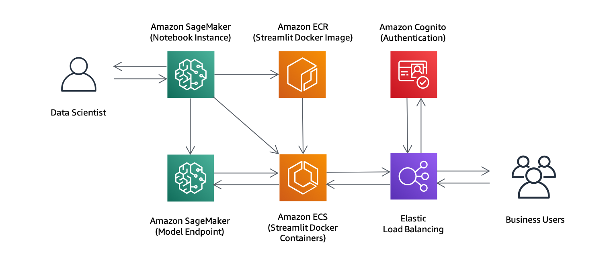

# Dashboards for Machine Learning with Amazon SageMaker

We showcase how a Data Scientist can develop a machine learning dashboard on Amazon SageMaker, and then share that dashboard with business users in a secure and robust way using Amazon ECS and Amazon Cognito. Our example dashboard uses Streamlit, but other dashboard tools can be switched in easily due to the containerized approach.

## Requirements

You will need an AWS account to use this solution. Sign up for an account [here](https://aws.amazon.com/).

You will also need to have permission to use [AWS CloudFormation](https://aws.amazon.com/cloudformation/) and to create all the resources detailed in the [architecture section](#architecture). All AWS permissions can be managed through [AWS IAM](https://aws.amazon.com/iam/). Admin users will have the required permissions, but please contact your account's AWS administrator if your user account doesn't have the required permissions.

## Getting Started

Click on one of the following buttons to *quick create* the AWS CloudFormation Stack:

<table>
  <tr>
    <th colspan="3">AWS Region</td>
    <th>AWS CloudFormation</td>
  </tr>
  <tr>
    <td>US West</td>
    <td>Oregon</td>
    <td>us-west-2</td>
    <td align="center">
      <a href="https://us-west-2.console.aws.amazon.com/cloudformation/home?region=us-west-2#/stacks/create/review?templateURL=https://sagemaker-solutions-us-west-2.s3-us-west-2.amazonaws.com/sagemaker-ml-dashboards/build/packaged.yaml&stackName=sagemaker-dashboards-for-ml&param_ResourceName=sagemaker-dashboards-for-ml&param_SageMakerNotebookGitRepository=https://github.com/awslabs/sagemaker-dashboards-for-ml">
        
      </a>
    </td>
  </tr>
</table>

You can use the default parameters, but check for any required fields that might not be completed. As an example, Amazon Cognito Authentication is enabled by default but you must provide an email address to receive the temporary credentials (i.e. the 'Sample User Email' parameter). After completing the parameters, you should acknowledge the use of the two capabilities at the bottom and click 'Create Stack'. Once stack creation has completed successfully, click the 'SageMakerNotebookInstanceURL' link on the 'Outputs' tab. You'll be signed onto the Amazon SageMaker Notebook Instance and see the Jupyter tree view. Click on the 'example' folder and choose one of the two examples ('nyu-uber-pickups' or 'text-generation'). Within each example you will find a Jupyter Notebook (`*.ipynb`). Open this and follow the instruction inside the notebook.

**Caution**: Cloning this GitHub repository and running the code manually could lead to unexpected issues! Use the AWS CloudFormation template. You'll get an Amazon SageMaker Notebook instance that's been correctly setup and configured to access the other resources in the solution.

## Contents

* `cloudformation/`
  * `template.yaml`: Creates AWS CloudFormation Stack for solution.
  * `development/`
    * `development.yaml`: Creates AWS CloudFormation Stack for development.
  * `deployment/`
    * `deployment.yaml`: Creates AWS CloudFormation Stack for deployment.
    * `self-signed-certificate/`: Custom resource to create self-signed SSL certificate.
    * `string-functions/`: Custom resource to perform string functions in stack.
  * `solution-assistant/`: Custom resource to clean up stack resources.
* `docs/`: Additional documentation and diagrams.
* `examples/`
  * `nyc-uber-pickups/`
    * `dashboard/`
      * `src/`
        * `app.py`: Streamlit application code.
      * `Dockerfile`: Container requirements for dashboard.
      * `requirements.in`: Unpinned Python requirements for dashboard.
      * `requirements.txt`: Pinned Python requirements for dashboard.
    * `nyu-uber-pickups.ipynb`: Orchestrates the solution for this example.
    * `utils.py`: Useful functions for dashboard development.
  * `text-generation/`
    * `dashboard/`
      * `src/`
        * `app.py`: Streamlit application code.
      * `Dockerfile`: Container requirements for dashboard.
      * `requirements.in`: Unpinned Python requirements for dashboard.
      * `requirements.txt`: Pinned Python requirements for dashboard.
    * `model/`
      * `entry_point.py`: Code used for model inference.
      * `requirements.in`: Unpinned Python requirements for model.
      * `requirements.txt`: Pinned Python requirements for model.
    * `text-generation.ipynb`: Orchestrates the solution for this example.
    * `utils.py`: Useful functions for dashboard development.

## Architecture

As part of the solution, the following services are used:

* [Amazon SageMaker Notebook](https://aws.amazon.com/sagemaker/): Used to develop the dashboard.
* [Amazon SageMaker Endpoint](https://aws.amazon.com/sagemaker/): Used to deploy an example trained model.
* [Amazon ECR](https://aws.amazon.com/ecr/): Used to store the custom dashboard Docker image.
* [Amazon ECS](https://aws.amazon.com/ecs/): Used to run custom dashboard Docker containers inside a managed service.
* [Amazon Cognito](https://aws.amazon.com/cognito/): Used to manage authentication to the dashboard.
* [Elastic Load Balancing](https://aws.amazon.com/elasticloadbalancing/): Used to interface with Amazon Cognito and ECS service.

<p align="center">
  
</p>

## Costs

You are responsible for the cost of the AWS services used while running this solution.

As of 25th May 2020 in the US West (Oregon) region, the cost to:

* run an ml.t3.medium Amazon SageMaker Notebook Instance for development is $0.0582 per hour.
* store model artifacts in Amazon S3 is $0.023 per GB-month.
* host a DistilGPT-2 model on an ml.c5.xlarge Amazon SageMaker Hosting Instance is $0.238 per hour.
* store dashboard Docker containers in Amazon ECR is $0.10 per GB-month.
* run a dashboard Application Load Balancer is $0.0225 per hour and $0.008 per [LCU-hour](https://aws.amazon.com/elasticloadbalancing/pricing/).
* run a dashboard Amazon ECS task (1 vCPU and 2GB of memory) is $0.04937 per hour.
* protect your dashboard with Amazon Cognito is $0.0055 per monthly active user.

All prices are subject to change. See the pricing webpage for each AWS service you will be using in this solution.

## Cleaning Up

When you've finished with this solution, make sure that you delete all
unwanted AWS resources. AWS CloudFormation can be used to automatically delete
all standard resources that have been created by the solution and notebook.
Go to the AWS CloudFormation Console, and delete the *parent* stack.
Choosing to delete the parent stack will automatically delete the nested stacks.

Or use the AWS Command Line Interface:

```bash
aws cloudformation delete-stack \
--stack-name sagemaker-ml-dashboards
```

**Caution**: You need to manually delete any extra resources that you may have
created in this notebook. Some examples include, extra Amazon S3 buckets (to
the solution's default bucket), extra Amazon SageMaker endpoints (using a
custom name), and extra Amazon ECR repositories.

## Customization

See the [Customization Guide](./docs/customization.md) for more details.

## Troubleshooting

See the [Troubleshooting Guide](./docs/troubleshooting.md) for more details.

## FAQ

### What are 'sticky sessions'? And should they be enabled on the Application Load Balancer?

Sticky sessions are a mechanism to route user requests to the same
dashboard server (sometimes called a 'target') over the course of a
session. When using an ECS Service, there can be multiple dashboard servers
running at the same time. Sticky sessions can be useful when each dashboard
server maintains state information in order to provide a continuous
experience to users, but not all dashboard severs require sticky sessions.
Certain libraries (such as Streamlit) use WebSockets which are inherently
sticky, so sticky sessions are not required in this case. See [target
groups](https://docs.aws.amazon.com/elasticloadbalancing/latest/application/load-balancer-target-groups.html)
for more details. Other dashboard libraries are stateless, and so once
again sticky sessions are not required.

Our solution does not use sticky session by default, but this can be
enabled by setting `ApplicationLoadBalancerStickySessions` to `true`.

## Useful Resources

* [Amazon SageMaker Developer Guide](https://docs.aws.amazon.com/sagemaker/latest/dg/whatis.html)
* [Amazon SageMaker Python SDK Documentation](https://sagemaker.readthedocs.io/en/stable/)
* [AWS CloudFormation User Guide](https://docs.aws.amazon.com/AWSCloudFormation/latest/UserGuide/Welcome.html)

## Credits

* NYC Uber Pickups
  * [Streamlit example](https://github.com/streamlit/demo-uber-nyc-pickups)
  * [NYC Uber pickups dataset](https://www.kaggle.com/fivethirtyeight/uber-pickups-in-new-york-city)
* Text Generation
  * [GPT-2 model](https://openai.com/blog/better-language-models/)
  * [DistilGPT-2 model](https://transformer.huggingface.co/model/distil-gpt2)

## License

This project is licensed under the Apache-2.0 License.